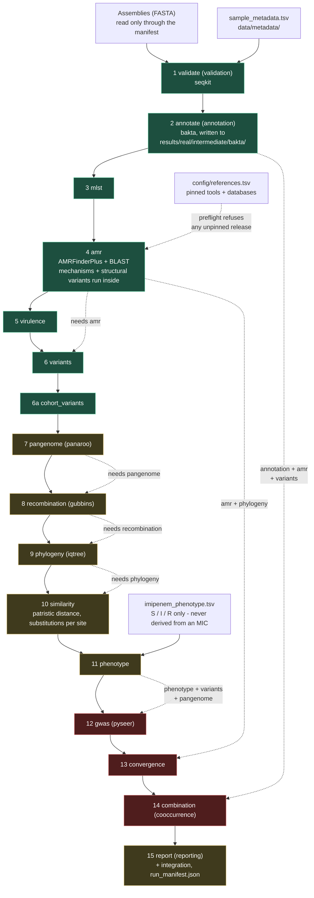
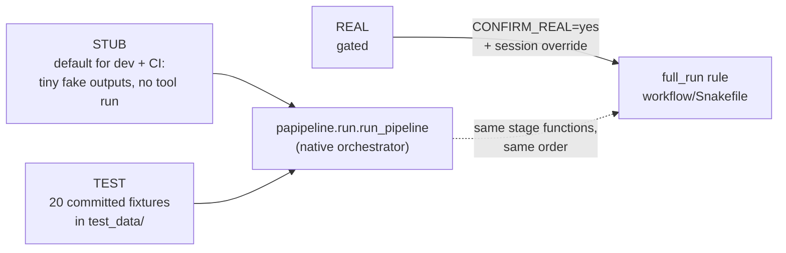

# Pipeline flowchart

The stage order, drawn. Sixteen stages: fifteen numbered rows plus `6a`
`cohort_variants`, added by the spec amendment of 2026-09-29 (`spec.md:363`).

Two names exist for each stage — the spec's (`spec.md` D1) and the code's
(`papipeline.run.STAGE_ORDER`). Both are shown; the code name is what you will
see in a log, a table filename and a `--only` argument.

| # | spec | code | tool |
|---|---|---|---|
| 1 | `validate` | `validation` | seqkit |
| 2 | `annotate` | `annotation` | bakta |
| 3 | `mlst` | `mlst` | mlst (`paeruginosa`) |
| 4 | `amr` | `amr` | AMRFinderPlus (+ BLAST) |
| 5 | `virulence` | `virulence` | BLAST vs VFDB |
| 6 | `variants` | `variants` | minimap2 + samtools |
| 6a | `cohort_variants` | `cohort_variants` | internal |
| 7 | `pangenome` | `pangenome` | panaroo |
| 8 | `recombination` | `recombination` | gubbins (needs mafft) |
| 9 | `phylogeny` | `phylogeny` | iqtree |
| 10 | `similarity` | `similarity` | distance from the stage-9 tree |
| 11 | `phenotype` | `phenotype` | internal |
| 12 | `gwas` | `gwas` | pyseer (12a filter, 12b association) |
| 13 | `convergence` | `convergence` | internal |
| 14 | `combination` | `cooccurrence` | internal |
| 15 | `report` | `reporting` | internal |

`mechanisms`, `regulators`, `structural_variants` and `integration` are **not
stages and have no stage number** (`spec.md:351`): they run inside stage 4,
alongside stage 4, and inside stage 15 respectively.

`docs/architecture.md` describes a different, older taxonomy and
`workflow/Snakefile` declares twenty rules (sixteen stages plus entry points).
**The spec wins**, as `AGENTS.md` says. Where they disagree, this diagram
follows the spec and `STAGE_ORDER`.

## Reading the legend

| Colour | Meaning |
|---|---|
| green | ran on **real** data — 8 of 16 stages, on a 10-isolate smoke cohort (`docs/STATUS.md`) |
| amber | built and dispatched, but **never run on real data** |
| red | **refuses REAL** by design — `papipeline.run.REAL_REFUSING_STAGES`: stage 12 has no REAL engine (lineage confounding), stage 13 would be indistinguishable from TEST, stage 14 cannot be tested on a synthetic cohort |

No cell of that legend is a biological result. `docs/STATUS.md` opens with the
same warning: n = 10 is grossly underpowered.

## Where the modes enter

Both entry points call the same stage functions in the same order, so they
cannot disagree about the science. `full_run` is the production path: one
process, one pass, every stage exactly once.

REAL needs two gates: the operator's `CONFIRM_REAL=yes`
(`scripts/linux/run_meropenem_real.sh`, see `docs/LINUX_RUN.md`) and the
pipeline's own `runtime.allow_real_mode` check, which every committed overlay
keeps `false`.

## Not drawn

* **Per-stage Snakemake rules.** `workflow/Snakefile` declares one rule per
  stage for re-running a single stage against an existing results tree, plus
  `rule full_run`. They are not the path a full run takes, and each per-stage
  rule re-runs its own prerequisites in-process — see the cost note at the top
  of the Snakefile.
* **Reporting's full input list.** Stage 15 consumes validation, phenotype, amr,
  cooccurrence, gwas, convergence, phylogeny, variants, recombination,
  similarity and cohort_variants (`papipeline.run.PREREQUISITES`). Only the
  stages with a single clear upstream are dotted above; drawing all eleven
  edges would hide the chain rather than explain it.
* **The event stream.** `scripts/emit.py` writes `status/events.jsonl`, and the
  observatory serves `/api/events` from an in-process `EventBus`; the two do not
  meet (`AGENTS.md`, STUB mode).
* **Edges nobody declared.** The dotted arrows are the dependencies
  `papipeline.run.PREREQUISITES` declares. Stages with no declared prerequisite
  appear only in the solid stage order, because drawing an undeclared edge
  would be inventing a dependency.
